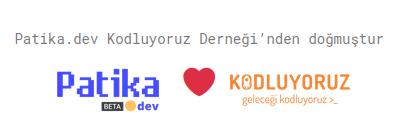

# Kodluyoruz Ilk Repo
Kodluyoruz egitimleri kapsaminda acilan ilk repo.
kodluyoruz.org ve patika.dev egitimleri kampsaminda tamamlanan proje detaylarini icerir.
<br>


## Installation
Projeyi indirmek icin;
```bash
git clone https://github.com/gurkandyilmaz/kodluyoruz.git
```

## Usage
Projeyi indirdikten sonra herhangi bir editorde aciniz. Example: VSCode
```linux
cd kodluyoruz/
code .
```

## Contributing
1) Ilk olarak degisikliklerin yapilacagi yeni bir branch olusturunuz.
2) Degisiklikleri tamamladiktan sonra pushlayip Pull Request aciniz.

## License
[MIT](https://choosealicense.com/licences/mit)
